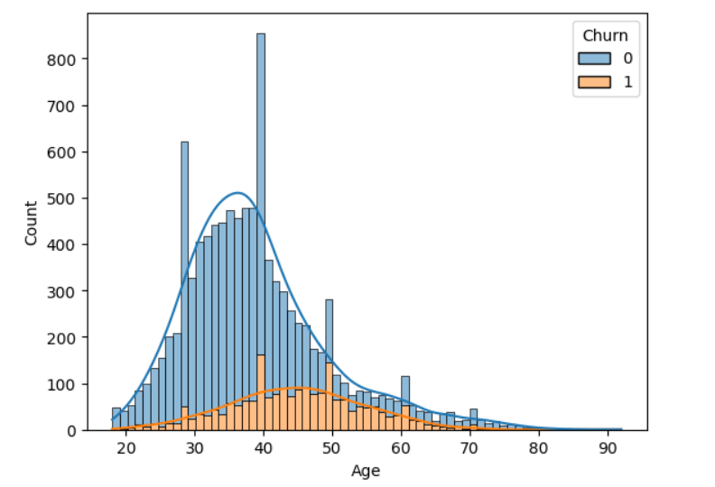
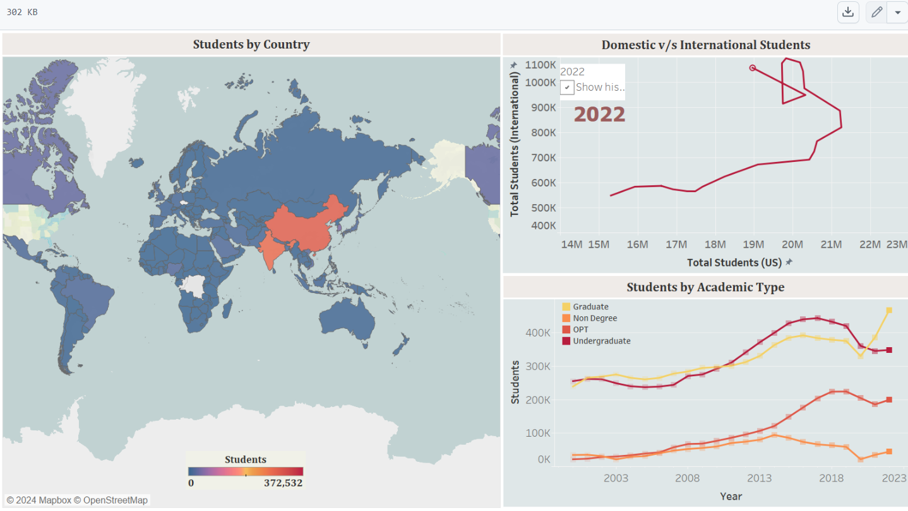
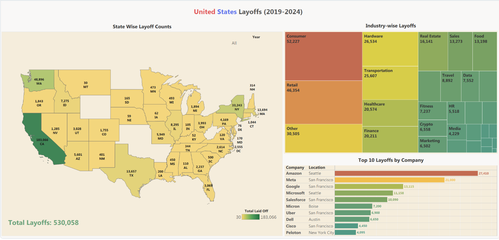
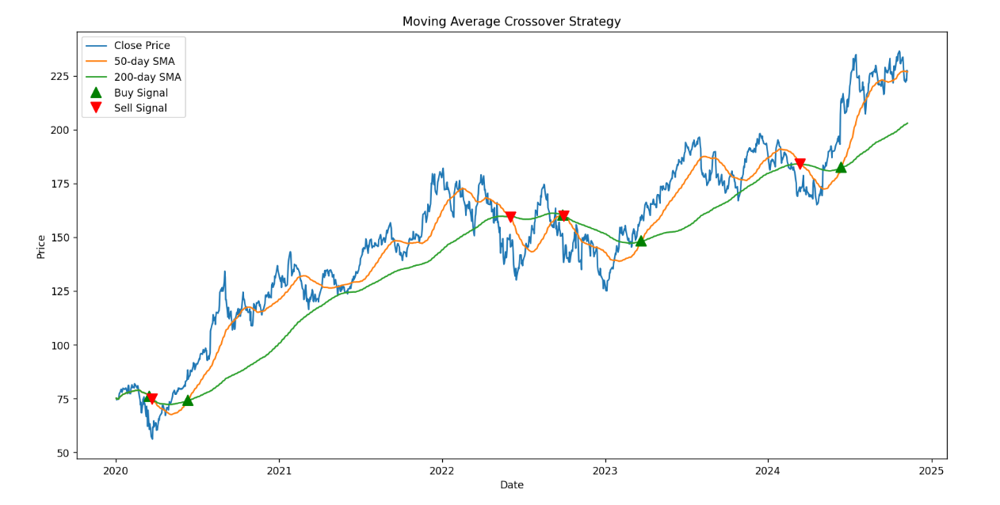
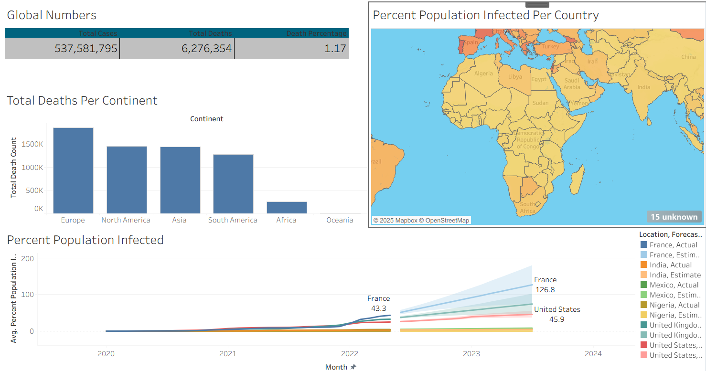

<html lang="en">
<head>
  <meta charset="UTF-8" />
  <meta name="viewport" content="width=device-width, initial-scale=1.0" />
  <title>My Project Gallery</title>
  
</head>
<body>

  <header>
    <h1>My Visualization Portfolio</h1>
    
A collection of my projects and data visualizations

  </header>

  

    <!-- Project 1 -->
    

      
      

        <h3>
          <a href="https://github.com/Favourson/PortfolioProjects/blob/main/Customer%20Churn%20Analysis%20and%20Prediction/Customer%20Churn%20Prediction.ipynb" target="_blank">
            Project 1: Customer Churn Analysis
          </a>
        </h3>
        
A visualization of customer churn trends using Power BI and Python.

      

    

    <!-- Project 2 -->
    

      
      

        <h3>
          <a href="https://github.com/Favourson/PortfolioProjects/tree/main/International%20Student%20Demographics%20Tableau" target="_blank">
            Project 2: International Student Analysis
          </a>
        </h3>
        
Analysis of domestic and international student behaviour.

      

    

	
	<!-- Project 3 -->
    

      
      

        <h3>
          <a href="https://github.com/Favourson/PortfolioProjects/tree/main/Layoffs%20Analysis%20Project%20with%20Tableau" target="_blank">
            Project 3: Layoffs Analysis
          </a>
        </h3>
        
Understanding the layoff trends in different countries

      

    

	
	<!-- Project 4 -->
    

      
      

        <h3>
          <a href="https://github.com/Favourson/PortfolioProjects/tree/main/FinanceTradingStrategies/Moving%20Average%20Crossover" target="_blank">
            Project 4: Financial Trading Model
          </a>
        </h3>
        
Variations of trading indicators with tests and results.

      

    

	<!-- Project 5 -->
    

      
      

        <h3>
          <a href="https://github.com/Favourson/PortfolioProjects/tree/main/Covid%20-%2019%20Analysis" target="_blank">
            Project 5: Financial Trading Model
          </a>
        </h3>
        
Covid 19 Data Analysis

      

    

    <!-- Duplicate and edit cards for more projects -->
  

</body>
</html>

